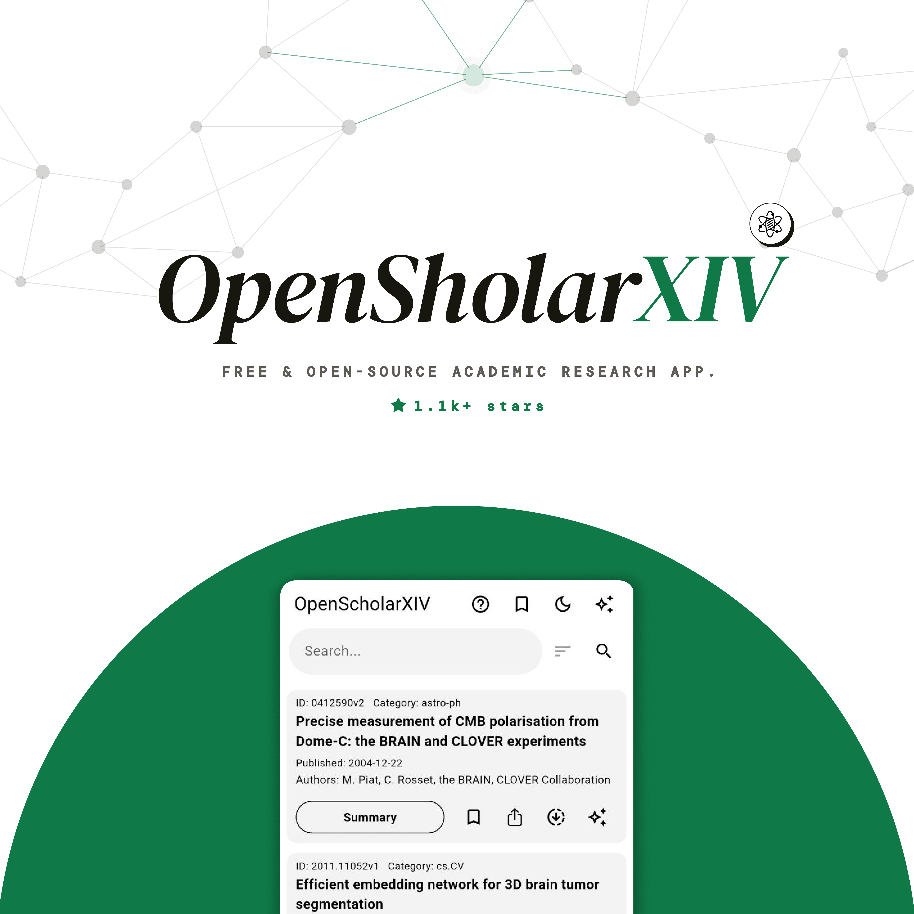
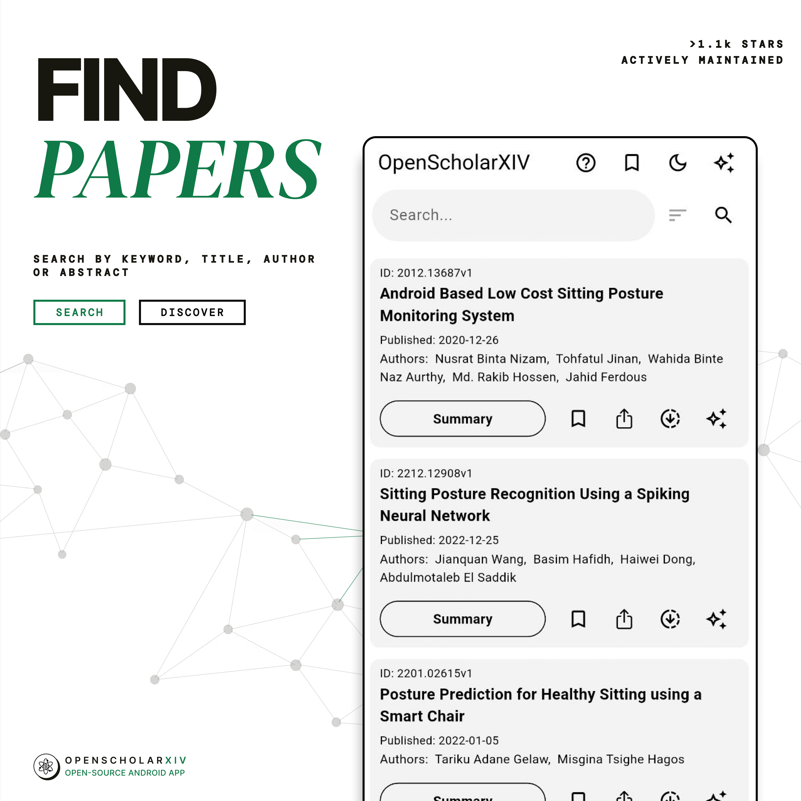
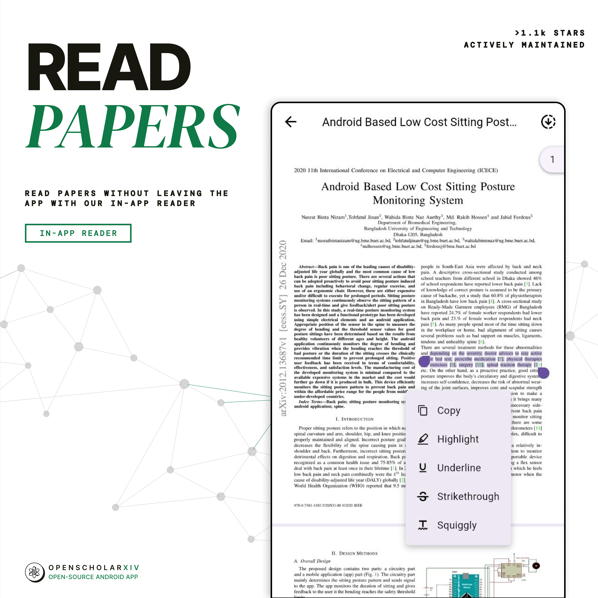
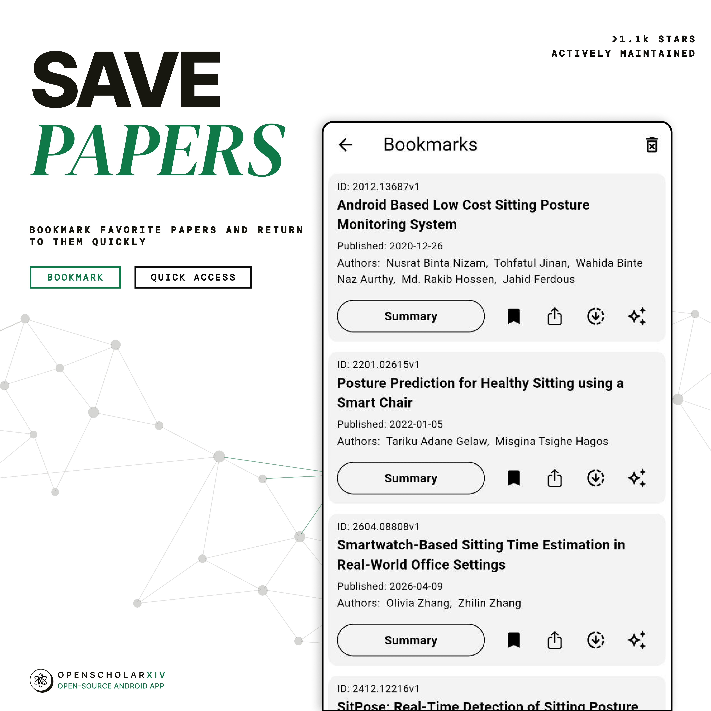
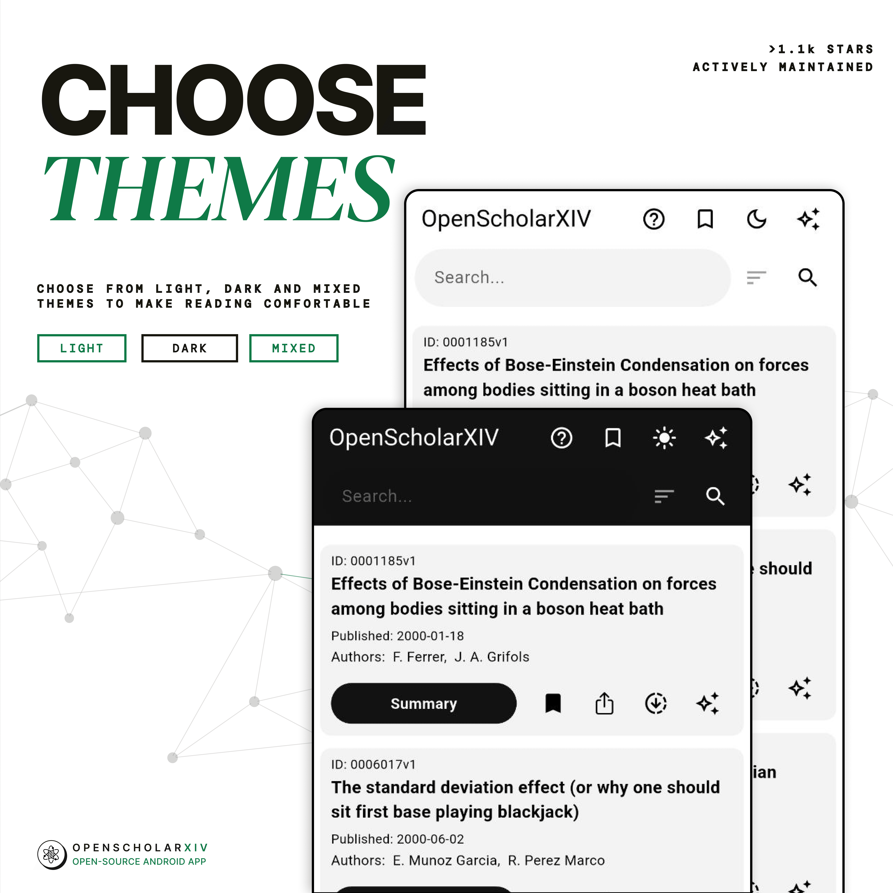
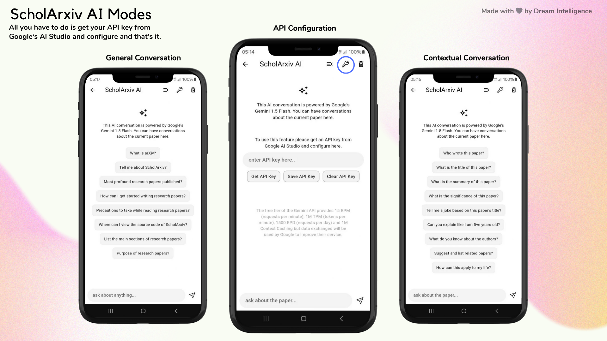
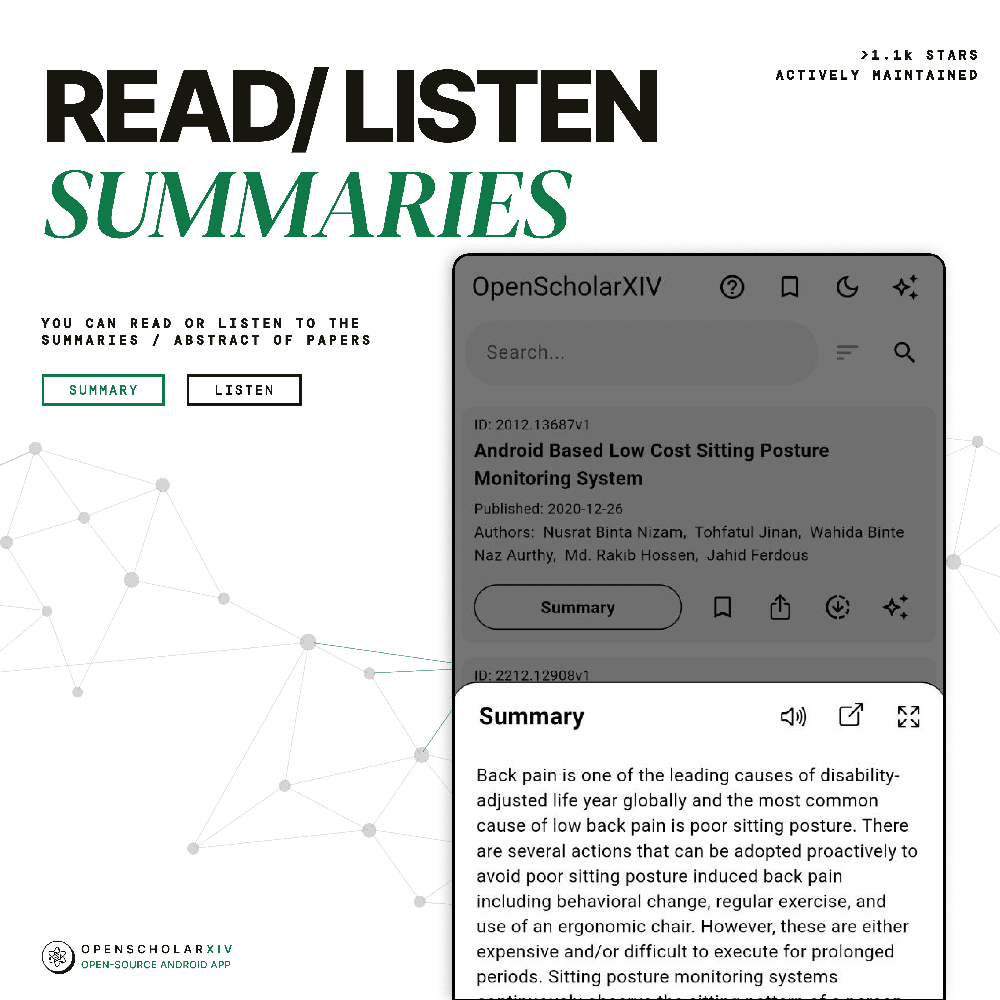
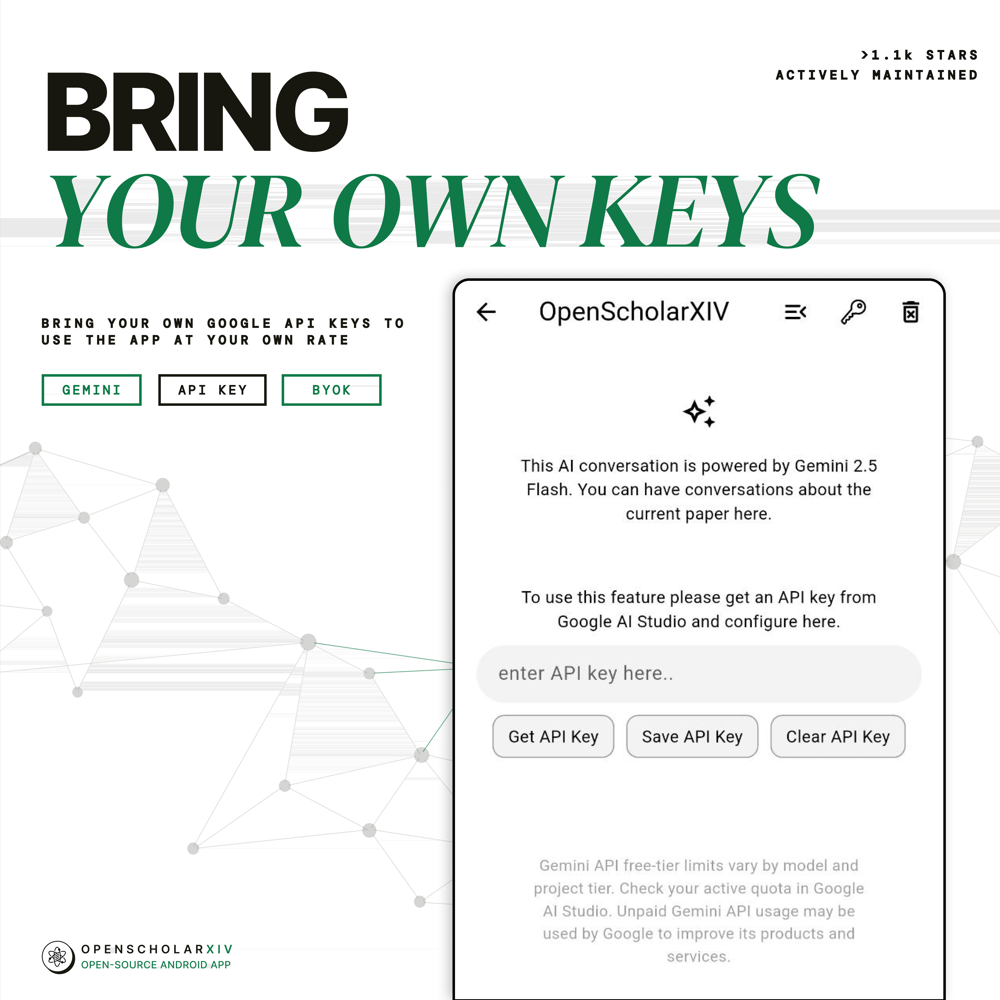

# OpenScholarXIV

 

**OpenScholarXIV** is a free and open-source app for browsing and exploring research papers with search, in-app reading, bookmarks, summaries, themes, and AI-powered chat. Use it to discover papers from arXiv, read them in a focused interface, save papers for later, and discuss research with AI using your own Gemini API key.

**[⬇️ Download Now](https://github.com/ScholarXIV/OpenScholarXIV/releases/download/v3.0.0/OpenScholarXIV.apk)** for the Latest Version. Enjoy!

<!-- Center Aligned the images in one row -->

<!-- 

 -->

## Features

🔎 **Search and Explore Papers**: Use the search bar to find research papers, or browse the suggested list to discover new research.

📚 **Read Papers In-app**: Read any paper directly inside OpenScholarXIV for a seamless, distraction-free experience.

🔖 **Bookmarks**: Save papers to read later by tapping the bookmark icon on any paper.

📝 **Summaries**: Tap the summary button on any paper to view the abstract, listen to it, and adjust the audio speed.

✨ **AI Chat**: Discuss a specific paper with AI from the paper card, or open AI Chat from the app bar for a general research conversation.

🔑 **API Configuration**: Add your own Gemini API key from the settings page to enable AI chat.

⬇️ **Download and Share**: Download papers for offline reading or share paper links with others.

☀️ **Themes**: Toggle between light, dark, and mixed themes from the app bar.

## How to Use

The in-app guide uses these same walkthrough screens:

### OpenScholarXIV

Completely free and open-source app to browse and explore research papers with AI-powered chat and more features.

### Search and Explore Papers

Use the search bar at the top to find research papers, or browse the suggested list of papers to discover new research.

### Read Papers In-app

Read any paper directly in the app for a seamless and distraction-free experience.

### Bookmark Papers

Bookmark papers to read later by tapping the bookmark icon on any paper.

### View and Listen to Summaries

Tap the summary button on any paper to view its summary, then use the volume icon to listen to it and adjust the audio speed.

### AI Chat

Discuss papers with AI by tapping the AI icon on a paper, or use the AI icon in the app bar for a general conversation.

### API Configuration

Add your own Gemini API key in the settings page to enable AI chat. Use the `GET API KEY` button to open the key page.

### Change Theme

Toggle between light, dark, and mixed themes using the theme icon in the app bar.

## Support, Shoutouts, Guides, Articles

-   Featured in How To Men's [Best Android Apps (September 2024)](https://youtu.be/rogxS9K26LE?si=1ivVCdYZhGVj3uSF&t=392) Video

-   Featured in InsTech's [1st Edition magazine](linkedin.com/pulse/top-10-latest-under-the-radar-ai-tech-tools-instechs-1st-waleed-zjq2f) and [YouTube Video](https://youtu.be/jFltWTk6YBE?si=PiPN-9tb566ROAiJ&t=216)

-   InnoVirtuoso's wrote a complete [explainer article](https://innovirtuoso.com/technology/exploring-scholarxiv-an-aesthetic-and-minimal-app-for-academic-papers/) about OpenScholarXIV

-   And Many More! THANK YOU SO MUCH FOR THE SUPPORT!

## Contribution

You can help support the project in three ways. ✨

1. By Contributing
    - Fork this repo
    - Add your new changes
    - Comment well
    - Open a PR
1. By Starring the Repo
1. By Sharing this Project to your friends and community

You can use the issues tab to get inspiration.

## More Illustrations

<!-- Center Aligned the images in one row -->

<!--

 -->

## License

This project is licensed under the GNU General Public License. You can make any contribution and distribute as long as your preleases are also open source - see the LICENSE file for details.

## Acknowledgements

Thank you to arXiv for the use of its open access interoperability.

---

_Made with 🤍 by [ScholarXIV](https://ScholarXIV.com)_
